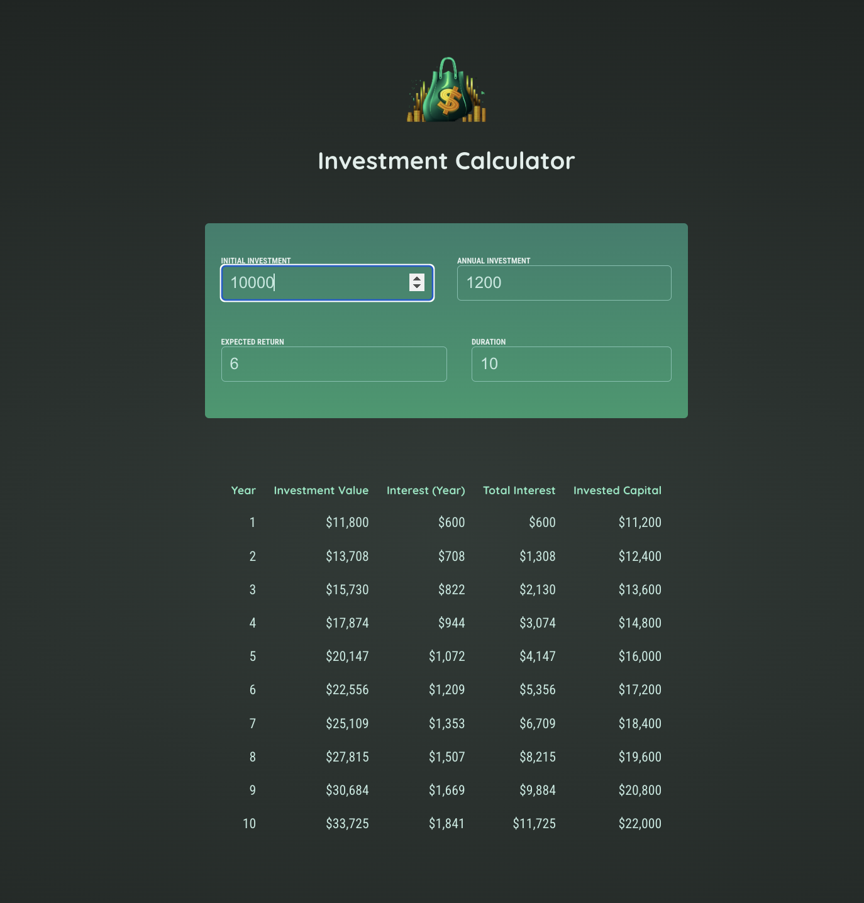
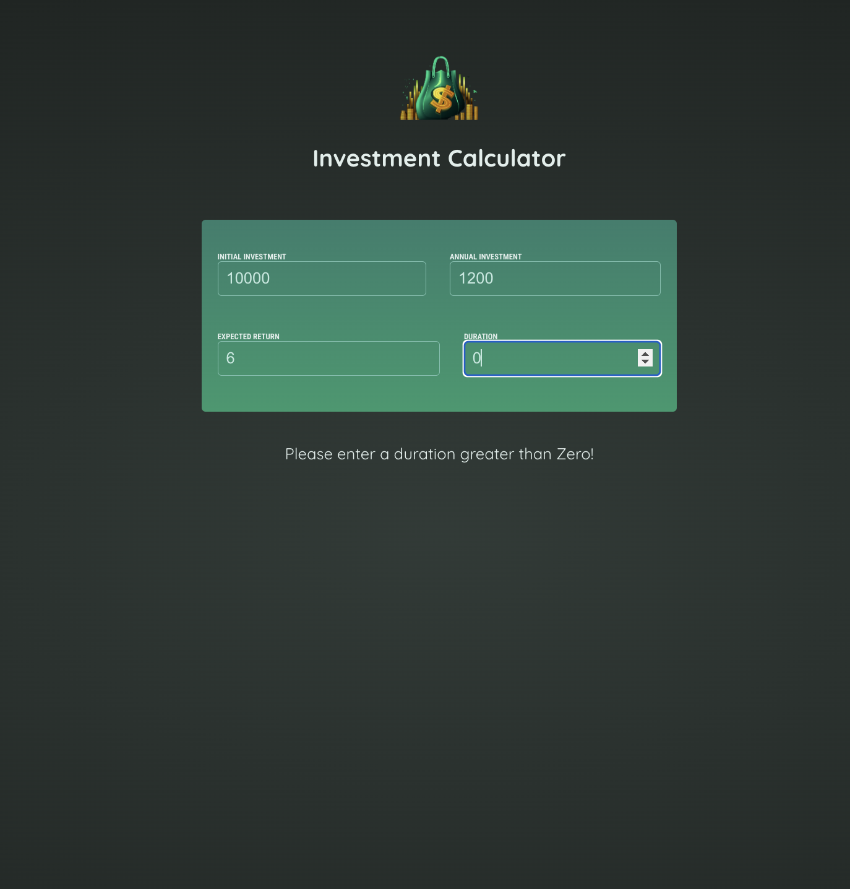

# Investment Calculator App

## Overview

This is a simple investment calculator app built with React. It allows users to calculate the future value of their investments based on the initial investment amount, annual interest rate, and the number of years.

## Features

- Calculate the future value of an investment
- Easy-to-use interface with form inputs
- Responsive design for a seamless experience on different devices

## Getting Started

Follow these instructions to get a copy of the project up and running on your local machine.

### Prerequisites

- Node.js and npm installed on your machine

### Installing

1. Clone the repository to your local machine:

    ```bash
    git clone https://github.com/sehaj23/investment-calculator.git
    ```

2. Navigate to the project directory:

    ```bash
    cd investment-calculator-react
    ```

3. Install dependencies:

    ```bash
    npm install
    ```

### Running the App

1. Start the development server:

    ```bash
    npm run dev
    ```

2. Open your browser and go to [http://localhost:5173](http://localhost:5173)

## Usage

1. Enter the initial investment amount.
2. Set the annual interest rate.
3. Specify the number of years for the investment.


## Technologies Used

- React
- JavaScript
- HTML
- CSS

## Contributing

Feel free to contribute to the project. Create a pull request, and we'll review it together.

## License

No License.

## Acknowledgments

- Inspired by the need for a simple investment calculator.
- Thanks to the React community for providing valuable resources and support.

## Screenshots


